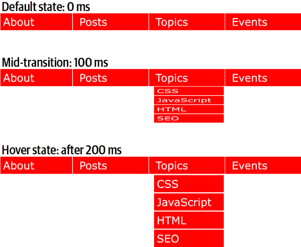
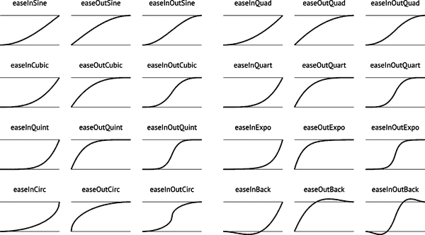
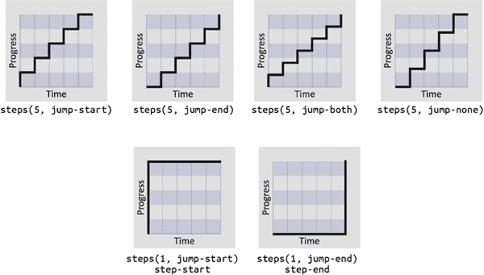

# 第十八章：过渡

CSS 过渡允许我们随着时间从原始值动画 CSS 属性到新值。这些变化*过渡*了元素从一个状态到另一个状态，响应某种变化。通常这涉及用户交互，但也可能是由于脚本更改类、ID 或其他状态。

通常情况下，当 CSS 属性值发生变化时——即发生*样式更改事件*时——变化是瞬时的。新的属性值在重新绘制页面时（或在必要时重新布局和重绘）立即替换旧的属性值。大多数值的变化似乎是瞬时的，渲染时间少于 16 毫秒。即使变化时间超过这个时间（比如当一个大图像被未预取的图像替换时——这不是过渡，只是性能差），仍然是从一个值到另一个值的单一步骤。例如，当鼠标悬停在背景颜色上时，背景立即从一种颜色变为另一种颜色，没有渐变过程。

# CSS 过渡

CSS 过渡提供了一种控制属性如何在一段时间内从一个值变化到另一个值的方法。因此，我们可以使属性值逐渐变化，创造（希望是）愉悦且不显眼的效果。

```
button {color: magenta;
    transition: color 200ms ease-in 50ms;
}
button:hover {color: rebeccapurple;
    transition: color 200ms ease-out 50ms;
}
```

在这个例子中，而不是在悬停时立即更改按钮的`color`值，`transition`属性意味着按钮的`color`将在 200 毫秒内从`magenta`逐渐淡入到`rebeccapurple`，甚至在开始过渡前添加 50 毫秒的延迟。

如果浏览器不支持 CSS 过渡属性（这种情况几乎不会发生），则变化是立即的而不是逐渐的，这完全没问题。如果某个属性或某些属性值不可动画化，则变化也将是即时的而不是逐渐的。

###### 注意

当我们说*可动画*时，我们指的是可以通过过渡或动画（下一章的主题，第十九章）进行动画化的任何属性。本书中的属性定义框指出给定属性是否可动画。

通常您会希望即时进行值的更改。例如，链接颜色通常在悬停或焦点时立即更改，通知视觉用户发生了交互，并且焦点内容是一个链接。类似地，自动完成列表框中的选项不应该淡入：您希望选项立即出现，而不是在用户键入时比慢慢淡入。即时值的更改通常是最佳的用户体验。

在其他时候，您可能希望属性的值更渐变地变化，以引起注意。例如，您可能希望通过花费 200 毫秒来动画翻转卡片，使得卡片游戏更加逼真，因为如果没有动画，用户可能不会意识到发生了什么。

###### 提示

寻找播放符号  以了解在线示例的可用性。本章中的所有示例都可以在 [*https://meyerweb.github.io/csstdg5figs/18-transitions*](https://meyerweb.github.io/csstdg5figs/18-transitions) 找到。

举个例子，您可能希望一些下拉菜单在 200 毫秒内展开或可见（而不是立即，这可能会令人不适）。使用过渡效果，您可以使下拉菜单缓慢显示。在 图 18-1  中，我们通过缩放变换来过渡子菜单的高度。这是 CSS 过渡的常见用法，我们稍后在本章中还将探讨这个话题。

###### 警告

特别是快速过渡效果，尤其是移动距离较大或占据页面主要部分的过渡效果，*可能会导致某些用户癫痫发作*。为了降低或消除这种风险，请使用 `prefers-reduced-motion` 媒体查询（请参见 第二十一章）。始终牢记这些问题，并确保设计对癫痫和其他癫痫症患者具有可访问性。



###### 图 18-1\. 初始过渡，中间过渡和最终状态

# 过渡属性

在 CSS 中，过渡效果通过四个过渡属性来定义：`transition-property`、`transition-duration`、`transition-timing-function` 和 `transition-delay`，同时使用 `transition` 属性作为这些属性的缩写形式。

为了创建 图 18-1 中的下拉导航，我们使用了所有四个 CSS 过渡属性，以及一些定义过渡开始和结束状态的变换属性。以下代码定义了该示例的过渡效果：

```
nav li ul {
    transition-property: transform;
    transition-duration: 200ms;
    transition-timing-function: ease-in;
    transition-delay: 50ms;
    transform: scale(1, 0);
    transform-origin: top center;
}
nav li:is(:hover, :focus) ul {
    transform: scale(1, 1);
}
```

虽然我们在此示例中使用 `:hover` 和 `:focus` 状态进行样式更改事件，但您也可以在其他情境下过渡属性。例如，您可以添加或删除类，或以其他方式改变状态—比如，从 `:invalid` 变为 `:valid` 或从 `:checked` 变为 `:not(:checked)`。或者您可以在斑马条纹表或基于 `:nth-last-of-type` 选择器的列表末尾附加表行或列表项。

在 图 18-1 中，嵌套列表的初始状态是 `transform:` `scale(1, 0)`，并且使用 `transform-origin: top center`。最终状态是 `transform:` `scale(1, 1)`，而 `transform-origin` 保持不变。（有关变换属性的更多信息，请参见 第十七章。）

在这个例子中，过渡属性定义了对`transform`属性的过渡：当在`hover`状态下设置新的`transform`值时，嵌套的无序列表将缩放到其原始默认大小，旧的`transform: scale(1, 0)`值和新的`transform: scale(1, 1)`值之间会平滑地变化，整个过程持续 200 毫秒。这个过渡在延迟 50 毫秒后开始，并*缓慢地进入*，这意味着它一开始会缓慢进行，然后随着时间的推移加快速度。

每当一个可动画目标属性发生变化时，如果该属性上设置了过渡效果，浏览器将应用过渡效果使变化逐渐进行。

请注意，所有过渡属性都是为默认的未悬停/未聚焦状态的`<ul>`元素设置的。这些状态仅用于改变变换，而不是过渡。这样做有一个很好的理由：这意味着菜单不仅在状态变化时会滑动打开，而且在悬停或焦点状态结束时也会滑动关闭。

想象一下如果过渡属性被应用于互动状态，就像这样：

```
nav li ul {
    transform: scale(1, 0);
    transform-origin: top center;
}
nav li:is(:hover, :focus) ul {
    transition-property: transform;
    transition-duration: 200ms;
    transition-timing-function: ease-in;
    transition-delay: 50ms;
    transform: scale(1, 1);
}
```

这意味着当未*悬停*或*聚焦*时，元素将具有默认的过渡值——也就是说，没有过渡或瞬时过渡。我们之前示例中的菜单会在互动状态结束时滑动打开，但一旦互动状态结束，即不再处于互动状态时，过渡属性将不再适用！

也许你确实想要这种效果：平滑地打开但瞬间消失。如果是这样，请按照前面的示例应用过渡效果。否则，直接将它们应用于默认状态的元素，以便在进入和退出互动状态时应用过渡效果。当退出状态变化时，过渡时间会反转。你可以通过在初始和改变状态中声明不同的过渡来覆盖这种默认的反向过渡效果。

*初始状态*指的是在页面加载时匹配元素的状态。这可能意味着一个可编辑内容的元素可能会获得`:focus`，如下所示：

```
/* selector that matches elements `all` the time */
p[contenteditable] {
    background-color: background-color: rgb(0 0 0 / 0);
}
/* selector that matches elements `some` of the time */
p[contenteditable]:focus {
    /* overriding declaration */
    background-color: background-color: rgb(0 0 0 / 0.1);
}

```

在这个例子中，完全透明的背景始终是初始状态，只有在用户给元素焦点时才会改变。这就是我们在本章中提到的*初始*或*默认*值的含义。选择器中包含的过渡属性将影响该元素在状态改变时的表现，包括从初始状态到改变状态（例如在上述例子中被聚焦时）。

初始状态也可以是一个临时状态，可能会改变，例如`:checked`复选框或`:valid`表单控件，甚至是一个被切换打开和关闭的类：

```
/* selector that matches elements `some` of the time */
input:valid {
    border-color: green;
}
/* selector that matches elements `some` of the time,
   when the prior selector does NOT match. */
input:invalid {
    border-color: red;
}
/* selector that matches elements `some` of the time,
   whether the input is valid or invalid */
input:focus {
    /* alternative declaration */
    border-color: yellow;
}

```

在此示例中，`:valid`或`:invalid`选择器可以匹配任何给定元素，但永远不会同时匹配。如 图 18-2 中所示，`:focus`选择器在输入框有焦点时匹配，无论输入框是否同时匹配`:valid`或`:invalid`选择器。

在这种情况下，当我们提到初始状态时，我们指的是原始值，可以是`:valid`或`:invalid`。给定元素的更改状态是初始`:valid`或`:invalid`状态的相反状态。


###### 图 18-2\. 在有效、无效和焦点状态下的输入框外观

记住，你可以将不同的过渡值应用于初始状态和更改后的状态，但始终要应用于*进入*给定状态时使用的值。以以下代码为例，这里设置了菜单在 2 秒内滑动打开，但在 200 毫秒内关闭：

```
nav li ul {
    transition-property: transform;
    transition-duration: 200ms;
    transition-timing-function: ease-in;
    transition-delay: 50ms;
    transform: scale(1, 0);
    transform-origin: top center;
}
nav li:is(:hover, :focus) ul {
    transition-property: transform;
    transition-duration: 2s;
    transition-timing-function: linear;
    transition-delay: 1s;
    transform: scale(1, 1);
}
```

这提供了一个糟糕的用户体验，但它阐明了这一点。 悬停或关注时，导航打开需要整整 2 秒。关闭时，它在 0.2 秒内迅速关闭。更改状态中的过渡属性在列表项悬停或关注时生效。因此，为这些状态定义的`transition-duration: 2s`生效。当菜单不再悬停或关注时，它返回到默认的缩小状态，并使用初始状态的过渡属性——`nav li ul`条件——导致菜单花费 200 毫秒关闭。

更仔细地查看示例，特别是默认的过渡样式。当用户停止悬停或关注父导航元素或子下拉菜单时，下拉菜单延迟 50 毫秒，然后开始`200ms`的过渡以关闭。这实际上是一种体验良好的用户体验样式，因为它给了用户一个（虽然很短暂的）机会将鼠标指针或焦点环回到菜单上，然后再开始关闭。

尽管可以单独声明四个过渡属性，但通常会使用简写。首先我们将逐个查看这四个属性，以便你能深入了解各自的作用。

## 通过属性限制过渡效果

`transition-property`属性指定要过渡的 CSS 属性的名称。这样可以限制只对某些属性进行过渡，而其他属性则立即改变。没错，说“`transition-property`属性”确实有点奇怪。

`transition-property`的值是属性的逗号分隔列表；如果您不想过渡任何属性，请使用关键字`none`；或默认的`all`，表示“过渡所有可动画属性”。您还可以在逗号分隔的属性列表中包含关键字`all`。

如果将`all`作为唯一关键字包含——或默认为`all`——所有可动画属性将同时过渡。假设您想在悬停时改变框的外观：

```
div {
    color: #ff0000;
    border: 1px solid #00ff00;
    border-radius: 0;
    transform: scale(1) rotate(0deg);
    opacity: 1;
    box-shadow: 3px 3px rgb(0 0 0 / 0.1);
    width: 50px;
    padding: 100px;
}
div:hover {
    color: #000000;
    border: 5px dashed #000000;
    border-radius: 50%;
    transform: scale(2) rotate(-10deg);
    opacity: 0.5;
    box-shadow: -3px -3px rgb(255 0 0 / 0.5);
    width: 100px;
    padding: 20px;
}
```

当鼠标指针悬停在`<div>`上时，初始状态与悬停（更改）状态具有不同值的每个属性都将更改为悬停状态的值。`transition-property`属性用于定义哪些属性随时间动画（而不是立即更改）。所有属性都在`hover`时从默认值更改为悬停值，但只有在`transition-property`中包含的可动画属性会在过渡期间发生变化。像`border-style`之类的不可动画属性会立即从一个值更改为另一个值。

如果在`transition-property`的逗号分隔值中，`all`是唯一的值或者是最后一个值，那么所有可动画属性将同时过渡。否则，请提供一个逗号分隔的属性列表，以便过渡属性影响这些属性。

因此，如果我们希望过渡所有属性，下面的声明几乎是等效的：

```
div {
    color: #ff0000;
    border: 1px solid #00ff00;
    border-radius: 0;
    opacity: 1;
    width: 50px;
    padding: 100px;
    transition-property: color, border, border-radius, opacity,
        width, padding;
    transition-duration: 1s;
}
div {
    color: #ff0000;
    border: 1px solid #00ff00;
    border-radius: 0;
    opacity: 1;
    width: 50px;
    padding: 100px;
    transition-property: all;
    transition-duration: 1s;
}
```

两个`transition-property`属性声明都将过渡所有列出的属性，但前者仅过渡可能更改的六个属性。

在后一条规则中，`transition-property: all`确保了基于任何样式更改事件的可动画属性值的过渡时间为 1 秒。该过渡适用于选择器匹配的所有元素上应用的所有可动画属性，而不仅仅是在相同样式块中声明的属性。

在这种情况下，第一个版本将过渡限制为仅列出的六个属性，但使我们能够更好地控制每个属性的过渡方式。逐个声明属性使我们能够为每个属性的过渡提供不同的速度、延迟和/或持续时间：

```
div {
    color: #ff0000;
    border: 1px solid #0f0;
    border-radius: 0;
    opacity: 1;
    width: 50px;
    padding: 100px;
}
.foo {
    color: #00ff00;
    transition-property: color, border, border-radius, opacity,
        width, padding;
    transition-duration: 1s;
}
```

```
<div class="foo">Hello</div>
```

如果您想要分别为每个属性定义过渡效果，请将所有属性都写出来，并使用逗号分隔每个属性。如果您希望以相同的持续时间、延迟和速度动画几乎所有属性，但有少数例外，您可以同时使用`all`和您希望在不同时间、速度或速度下过渡的个别属性的组合。只需确保将`all`作为第一个值使用，因为在`all`之前列出的任何属性将包含在`all`中，覆盖您打算应用于这些现在被覆盖属性的任何其他过渡属性值：

```
div {
    color: #f00;
    border: 1px solid #00ff00;
    border-radius: 0;
    opacity: 1;
    width: 50px;
    padding: 100px;
    transition-property: all, border-radius, opacity;
    transition-duration: 1s, 2s, 3s;
}
```

逗号分隔值的`all`部分包括示例中列出的所有属性，以及所有继承的 CSS 属性，以及与元素匹配或继承的任何其他 CSS 规则块中定义的所有属性。

在上面的例子中，所有获取新值的属性将以相同的持续时间、延迟和时间函数过渡，除了`border-radius`和`opacity`，我们明确单独包含它们。因为我们将它们作为`all`后面逗号分隔列表的一部分包含，我们可以将它们与所有其他属性一起过渡，或者我们可以为这两个属性提供不同的时间、延迟和时间函数。在这种情况下，我们将所有属性过渡时间设置为 1 秒，除了`border-radius`和`opacity`，分别设置为 2 秒和 3 秒。（`transition-duration`属性将在后面的章节中讨论。）

### 通过属性限制抑制过渡

虽然默认情况下不会自动过渡时间，但如果您确实包含了 CSS 过渡，并且想要在特定场景中覆盖该过渡，您可以设置`transition-property: none`来覆盖整个过渡，并确保不会过渡任何属性。

`none`关键字只能作为属性的唯一值使用—不能将其作为属性的逗号分隔列表的一部分包含。如果您想要覆盖有限属性集的过渡，您必须列出仍然希望过渡的所有属性。您不能使用`transition-property`属性来排除属性；而是只能使用该属性来包含它们。

###### 注意

另一种方法是将属性的延迟和持续时间设置为`0s`。这样，它将立即显示，就好像没有应用 CSS 过渡。

### 过渡事件

TransitionEvent 接口提供了四个与过渡相关的事件：`transitionstart`、`transitionrun`、`transitionend`和`transitioncancel`。我们将重点关注`transitionend`，因为它是可以由单个 CSS 多次触发的事件。

每次过渡结束时，无论属性是单独声明还是作为`all`声明的一部分，都会触发一个`transitionend`事件，无论是向任何方向过渡还是在任何延迟后。一些看似简单的属性声明会使用多个`transitionend`事件，因为缩写属性中的每个可动画属性都会有自己的`transitionend`事件。考虑以下情况：

```
div {
    color: #f00;
    border: 1px solid #00ff00;
    border-radius: 0;
    opacity: 1;
    width: 50px;
    padding: 100px;
    transition-property: all, border-radius, opacity;
    transition-duration: 1s, 2s, 3s;
}
```

当过渡结束时，将会发生超过六个`transitionend`事件。例如，仅`border-radius`过渡就会产生四个`transitionend`事件，分别为以下每个：

+   `border-bottom-left-radius`

+   `border-bottom-right-radius`

+   `border-top-right-radius`

+   `border-top-left-radius`

`padding` 属性也是四个长手属性的缩写：

+   `padding-top`

+   `padding-right`

+   `padding-bottom`

+   `padding-left`

`border` 缩写属性产生八个 `transitionend` 事件：四个值用于由 `border-width` 缩写表示的四个属性，另外四个用于由 `border-color` 表示的属性：

+   `border-left-width`

+   `border-right-width`

+   `border-top-width`

+   `border-bottom-width`

+   `border-top-color`

+   `border-left-color`

+   `border-right-color`

+   `border-bottom-color`

`border-style` 属性没有 `transitionend` 事件，因为 `border-style` 不是一个可动画化的属性。

在列出了六个特定属性——`color`、`border`、`border-radius`、`opacity`、`width` 和 `padding`——的情况下，会有 19 个 `transitionend` 事件：这六个属性包括几个缩写属性的长手属性的每个值，以及可能从其他影响元素的继承或在其他样式块中声明的属性值。

你可以像这样监听 `transitionend` 事件：

```
document.querySelector("div").addEventListener("transitionend",
    , (e) => {
      console.log(e.propertyName);
});
```

`transitionend` 事件包含三个特定事件属性：

`propertyName`

CSS 属性刚刚完成过渡的名称。

`pseudoElement`

过渡发生在的伪元素，由两个分号引导，如果过渡是在常规 DOM 节点上，则为空字符串。

`elapsedTime`

过渡运行所花费的时间，通常是在 `transition-duration` 属性中列出的时间。

对于成功过渡到新值的每个属性，将会发生一个 `transitionend` 事件。如果过渡被中断，比如移除导致过渡的状态更改或同一元素上的另一个属性更改，则不会触发。尽管如此，当它恢复到初始值或完成由元素上的其他属性值更改所做的值的过渡时，*将* 发生 `transitionend` 事件。

当属性返回到其初始值时，会再次触发 `transitionend` 事件。只要过渡开始，即使没有在原始方向完成初始过渡，此事件也会发生。

## 设置过渡持续时间

`transition-duration` 属性的值是以逗号分隔的时间长度列表，单位可以是秒（`s`）或毫秒（`ms`）。这些时间值描述了从一个状态过渡到另一个状态所需的时间。

在两个状态之间移动时，如果仅为其中一个状态声明了持续时间，则过渡持续时间将仅用于 *到* 该状态的过渡。考虑以下情况：

```
input {
    transition: background-color;
}
input:invalid {
    transition-duration: 1s;
    background-color: red;
}
input:valid {
    transition-duration: 0.2s;
    background-color: green;
}
```

因此，当输入无效时，将需要 1 秒才能将其更改为红色背景，当其有效时，仅需 200 毫秒即可过渡为绿色背景。

`transition-duration` 属性的值为正数，可以是秒 (`s`) 或毫秒 (`ms`)。规范要求使用 `ms` 或 `s` 的时间单位，即使持续时间设置为 `0s`。默认情况下，属性从一个值瞬间变为另一个值，不显示可见动画，这就是过渡持续时间的默认值为 `0s` 的原因。

除非在属性上设置了 `transition-delay` 的正值，否则如果省略了 `transition-duration`，则好像未应用 `transition-property` 声明一样，并且不会发生 `transitionend` 事件。只要过渡的总持续时间大于 0 秒（即 `transition-duration` 大于 `transition-delay`，包括大于默认的 `0s` 延迟），过渡仍将被应用，并且在过渡完成时会发生 `transitionend` 事件。

负值对于 `transition-duration` 是无效的，如果包含负值，则将使整个 `transition-duration` 声明无效。

使用前面相同冗长的 `transition-property` 声明，我们可以为所有属性声明单一持续时间，为每个属性声明单独的持续时间，或者我们可以使交替的属性在相同的时间内动画化。我们可以通过包含单一的 `transition-duration` 值来为过渡期间的所有属性声明单一持续时间：

```
 div {
    color: #ff0000;
    …
    transition-property: color, border, border-radius, opacity,
        width, padding;
    transition-duration: 200ms;
}
```

我们还可以为 `transition-duration` 属性值声明与 `transition-property` 属性值中列出的 CSS 属性相同数量的逗号分隔的时间值。如果我们希望每个属性过渡的时间不同，我们必须为每个声明的属性名称包含一个不同的逗号分隔值：

```
div {
    color: #ff0000;
    …
    transition-property: color, border, border-radius, opacity,
        width, padding;
    transition-duration: 200ms, 180ms, 160ms, 120ms, 1s, 2s;
}
```

如果声明的属性数量与声明的持续时间数量不匹配，则浏览器有特定的规则来处理不匹配情况。如果持续时间多于属性数量，则多余的持续时间将被忽略。如果属性数量多于持续时间，则持续时间将重复。在以下示例中，`color`、`border-radius` 和 `width` 的持续时间为 100 毫秒；`border`、`opacity` 和 `padding` 将设置为 200 毫秒。

```
div {
    …
    transition-property: color, border, border-radius, opacity,
        width, padding;
    transition-duration: 100ms, 200ms;
}
```

如果我们声明了正好两个逗号分隔的持续时间，那么每个奇数属性将在第一次声明的时间内进行过渡，每个偶数属性将在第二次声明的时间内进行过渡。

###### 提示

记住用户体验很重要。如果过渡太慢，网站会显得缓慢或不响应，吸引了本不应该引起的注意力。如果过渡太快，可能会太微妙而不易察觉。视觉效果应该足够长以便被看到，但不应太长以至于成为注意的中心。通常，一个可见但不分散注意力的过渡的最佳持续时间是 100 到 300 毫秒。

## 调整过渡的内部时间

想要过渡开始时缓慢并加速，开始时快速并结束缓慢，一直以相同速度前进，跳过多个步骤，甚至反弹吗？`transition-timing-function` 提供了控制过渡速度的方法。

`transition-timing-function` 值包括 `ease`、`linear`、`ease-in`、`ease-out`、`ease-in-out`、`step-start`、`step-end`、`steps(`*`n`*`, start)`—其中 *`n`* 是步骤数—`steps(`*`n`*`, end)`，以及 `cubic-bezier(x1, y1, x2, y2)`。（这些值也是 `animation-timing-function` 的有效值，并在第 19 章中有详细描述。）

### 立方贝塞尔时间函数

非步进关键字是作为平滑曲线提供的缓和时间函数，它们是对提供平滑曲线的数学贝塞尔函数的别名。规范中提供了五个预定义的缓和函数，如表 18-1 所示。

表 18-1\. 支持的立方贝塞尔时间函数关键字

| 时间函数 | 描述 | Cubic Bézier 值 |
| --- | --- | --- |
| `cubic-bezier()` | 指定一个立方贝塞尔曲线 | `cubic-bezier(*x1, y1, x2, y2*)` |
| `ease` | 起始缓慢，然后加速，之后减速，最后非常缓慢结束 | `cubic-bezier(0.25, 0.1, 0.25, 1)` |
| `linear` | 在整个过渡期间保持相同速度 | `cubic-bezier(0, 0, 1, 1)` |
| `ease-in` | 开始缓慢，然后加速 | `cubic-bezier(0.42, 0, 1, 1)` |
| `ease-out` | 开始快速，然后减速 | `cubic-bezier(0, 0, 0.58, 1)` |
| `ease-in-out` | 类似于 `ease`；中间快速，起始缓慢但结束时不像那么慢 | `cubic-bezier(0.42, 0, 0.58, 1)` |

立方贝塞尔曲线，包括在表 18-1 中显示的五个命名缓和函数的底层曲线，以及图 18-3 中显示的曲线，需要四个数值参数。例如，`linear` 相当于 `cubic-bezier(0, 0, 1, 1)`。第一个和第三个立方贝塞尔函数的参数值需要在 0 和 1 之间。


###### 图 18-3\. 命名立方贝塞尔函数的曲线表示

`cubic-bezier()` 函数中的四个数字定义了一个盒子内两个*控制点*的*x*和*y*坐标。这些控制点是从盒子的左下角到右上角延伸的线段的端点。曲线是通过贝塞尔函数使用两个角和两个控制点的坐标来构建的。

要了解其工作原理，请查看图 18-4 中显示的曲线及其对应的值。


###### 图 18-4\. 四个贝塞尔曲线及其`cubic-bezier()`值（来自[*http://cubic-bezier.com*](http://cubic-bezier.com)）

考虑第一个例子。前两个值对应*x1*和*y1*，分别是`0.5`和`1`。如果你在方框的中间横跨一半（*x1* = 0.5），并且向方框顶部走到底（*y1* = 1），你就到了第一个控制点的位置。同样，*x2,y2*的坐标`0.5,0`描述了方框中心底部的点，即第二个控制点的位置。所示的曲线是由这些控制点的放置产生的。

在第二个例子中，控制点的位置被交换，曲线也随之改变。第三和第四个例子也是彼此倒置的。注意在交换控制点位置时，得到的曲线有何不同。

预定义的关键术语相当有限。为了更好地遵循动画原则，您可能希望使用包含四个浮点值的立方贝塞尔函数，而不是预定义的关键字。如果你精通微积分或者在像 Illustrator 这样的程序上有很多经验，你也许能够自己脑补立方贝塞尔函数；否则，在线工具可以让你尝试不同的值，比如[*http://cubic-bezier.com*](http://cubic-bezier.com)，这个网站可以让你比较常见的关键字或者你自己的立方贝塞尔函数。

如图 18-5 所示，网站[*http://easings.net*](http://easings.net)提供了许多额外的立方贝塞尔函数值，供您使用以提供更逼真、令人愉悦的动画效果。



###### 图 18-5\. 有用的作者定义的立方贝塞尔函数（来自[*http://easings.net*](http://easings.net)）

网站的作者为他们的动画命名，但这些名称不属于 CSS 规范的一部分，必须按照表 18-2 中显示的方式书写。

表 18-2\. 立方贝塞尔定时

| 非官方名称 | 立方贝塞尔函数值 |
| --- | --- |
| `easeInSine` | `cubic-bezier(0.47, 0, 0.745, 0.715)` |
| `easeOutSine` | `cubic-bezier(0.39, 0.575, 0.565, 1)` |
| `easeInOutSine` | `cubic-bezier(0.445, 0.05, 0.55, 0.95)` |
| `easeInQuad` | `cubic-bezier(0.55, 0.085, 0.68, 0.53)` |
| `easeOutQuad` | `cubic-bezier(0.25, 0.46, 0.45, 0.94)` |
| `easeInOutQuad` | `cubic-bezier(0.455, 0.03, 0.515, 0.955)` |
| `easeInCubic` | `cubic-bezier(0.55, 0.055, 0.675, 0.19)` |
| `easeOutCubic` | `cubic-bezier(0.215, 0.61, 0.355, 1)` |
| `easeInOutCubic` | `cubic-bezier(0.645, 0.045, 0.355, 1)` |
| `easeInQuart` | `cubic-bezier(0.895, 0.03, 0.685, 0.22)` |
| `easeOutQuart` | `cubic-bezier(0.165, 0.84, 0.44, 1)` |
| `easeInOutQuart` | `cubic-bezier(0.77, 0, 0.175, 1)` |
| `easeInQuint` | `cubic-bezier(0.755, 0.05, 0.855, 0.06)` |
| `easeOutQuint` | `cubic-bezier(0.23, 1, 0.32, 1)` |
| `easeInOutQuint` | `cubic-bezier(0.86, 0, 0.07, 1)` |
| `easeInExpo` | `cubic-bezier(0.95, 0.05, 0.795, 0.035)` |
| `easeOutExpo` | `cubic-bezier(0.19, 1, 0.22, 1)` |
| `easeInOutExpo` | `cubic-bezier(1, 0, 0, 1)` |
| `easeInCirc` | `cubic-bezier(0.6, 0.04, 0.98, 0.335)` |
| `easeOutCirc` | `cubic-bezier(0.075, 0.82, 0.165, 1)` |
| `easeInOutCirc` | `cubic-bezier(0.785, 0.135, 0.15, 0.86)` |
| `easeInBack` | `cubic-bezier(0.6, -0.28, 0.735, 0.045)` |
| `easeOutBack` | `cubic-bezier(0.175, 0.885, 0.32, 1.275)` |
| `easeInOutBack` | `cubic-bezier(0.68, -0.55, 0.265, 1.55)` |

### 步骤时间

步骤时间函数也是可用的，以及四个预定义的步骤值；参见表 18-3。

表 18-3\. 步骤时间函数

| 时间函数 | 定义 |
| --- | --- |
| `steps(<integer>, jump-start)` | 显示<*`integer`*>关键帧，在过渡开始时的最后*n*/100%持续时间内显示最后一个关键帧；第一次跳跃发生在过渡的最开始。`start`可以替代`jump-start` |
| `steps(<integer>, jump-end)` | 显示<*`integer`*>关键帧，在过渡持续时间的开始*n*/100%内保持初始状态；最后一次跳跃发生在过渡的最后。`end`可以替代`jump-end` |
| `steps(<integer>, jump-both)` | 显示<*`integer`*>关键帧，从立即跳跃开始，直到过渡持续时间结束时的最后一次跳跃；这实际上增加了一个步骤到过渡中 |
| `steps(<integer>, jump-none)` | 显示<*`integer`*>关键帧，但在过渡持续时间的开始或结束时没有跳跃，而是在前*n*/100%的时间内保持初始值，并在最后*n*/100%的时间内显示最终值；这实际上从过渡中移除了一个步骤 |
| `step-start` | 在整个过渡持续时间内停留在最后一个关键帧；等同于`steps(1, jump-start)` |
| `step-end` | 在整个过渡持续时间内停留在初始关键帧；等同于`steps(1, jump-end)` |

如图 18-6 所示，步骤时间函数显示了过渡从初始值到最终值的步骤进展，而不是平滑曲线。



###### 图 18-6\. 步骤时间函数

步骤时间函数允许您通过定义步数和步骤的方向来划分过渡成等距的步骤。

使用`jump-start`时，第一步发生在动画或过渡开始时。使用`jump-end`时，最后一步发生在动画或过渡结束时。例如，`steps(5, jump-end)`会在 0%、20%、40%、60%和 80%的等距步骤中跳跃；而`steps(5, jump-start)`会在 20%、40%、60%、80%和 100%的等距步骤中跳跃。

`step-start` 函数与 `steps(1, jump-start)` 相同。当使用时，过渡属性值从开始到结束都保持在它们的*最终*值上。`step-end` 函数与 `steps(1, jump-end)` 相同，将过渡值设置为它们的*初始*值，并在整个过渡期间保持在那里。

###### 注意

步进时间函数，特别是 `jump-start` 和 `jump-end` 的确切含义，在 第十九章 中有深入讨论。

继续使用我们之前使用过的同样冗长的 `transition-property` 声明，我们可以为所有属性声明单个时间函数，或为每个属性定义单独的时间函数等。在这里，我们将所有过渡属性设置为单一的持续时间和时间函数：

```
div {
    transition-property: color, border-width, border-color, border-radius,
        opacity, width, padding;
    transition-duration: 200ms;
    transition-timing-function: ease-in;
}
```

永远记住，`transition-timing-function` 不会改变过渡属性所需的时间：这是由 `transition-duration` 属性设置的。它只是改变了在设定时间内过渡的进度。请考虑以下内容：

```
div {
    …
    transition-property: color, border-width, border-color, border-radius,
        opacity, width, padding;
    transition-duration: 200ms;
    transition-timing-function: ease-in, ease-out, ease-in-out,
        step-end, step-start, steps(5, jump-start), steps(3, jump-end);
}
```

如果我们为这七个属性设置了这七个时间函数，并且它们具有相同的过渡持续时间和延迟，所有属性都会在相同的时间开始和结束过渡。（顺便说一句，前面的过渡体验真是糟糕透顶，请不要这样做。）

熟悉各种时间函数的最佳方法是尝试它们，并看看哪一个对您想要的效果最有效。在测试时，设置一个相对较长的 `transition-duration` 可以更好地可视化各种函数之间的差异。在更高的速度下，您可能无法区分不同的缓动函数。只是不要忘记在发布结果之前将过渡速度恢复为更快的速度！

## 延迟过渡

`transition-delay` 属性允许您在应用于元素的变化开始引发过渡和实际过渡开始之间引入延迟。

`transition-delay` 的值为 `0s`（默认值）意味着过渡会立即开始；当元素的状态改变时立即执行。例如，这在 `a:hover` 的瞬间变化效果中很常见。

当 `transition-delay` 的值不为 `0s` 时，`transition-delay` 的 <*`time`*> 值定义了从属性值通常会改变的时刻到 `transition` 或 `transition-property` 值声明的属性值开始动画到最终值之间的时间偏移量。

有趣的是，时间的负值是有效的。您可以使用负的 `transition-delay` 创建的效果在 “负延迟值” 中有描述。

继续使用我们已经使用过的包含 6 个（或 19 个）属性的 `transition-property` 声明，我们可以通过省略 `transition-delay` 属性或将其值设置为 `0s`，使所有属性立即开始过渡。另一种可能性是，我们可以让一半的过渡立即开始，然后另一半延迟 200 毫秒，如下所示：

```
div {
    transition-property: color, border, border-radius, opacity,
        width, padding;
    transition-duration: 200ms;
    transition-timing-function: linear;
    transition-delay: 0s, 200ms;
}
```

通过在一系列属性上包含 `transition-delay: 0s, 200ms`，每个属性的过渡时间为 200 毫秒，我们使得 `color`、`border-radius` 和 `width` 立即开始过渡。其余属性将在其他过渡完成后开始过渡，因为它们的 `transition-delay` 等于应用于所有属性的 `transition-duration`。

与 `transition-duration` 和 `transition-timing-function` 一样，当逗号分隔的 `transition-delay` 值超过逗号分隔的 `transition-property` 值时，多余的延迟值将被忽略。当逗号分隔的 `transition-property` 值超过逗号分隔的 `transition-delay` 值时，延迟值将被重复。

我们甚至可以声明七个 `transition-delay` 值，以便每个属性在前一个属性过渡后开始过渡，如下所示：

```
div {
    …
    transition-property: color, border-width, border-color, border-radius,
        opacity, width, padding;
    transition-duration: 200ms;
    transition-timing-function: linear;
    transition-delay: 0s, 0.2s, 0.4s, 0.6s, 0.8s, 1s, 1.2s;
}
```

在这个例子中，我们声明每个过渡的持续时间为 200 毫秒，使用 `transition-duration` 属性。然后，我们声明了一个 `transition-delay`，为每个属性提供了逗号分隔的延迟值，每个属性的延迟值递增 200 毫秒，即 0.2 秒——与每个属性过渡的持续时间相同。最终结果是，每个属性在前一个属性完成过渡后开始过渡。

我们可以利用数学方法，为每个过渡属性指定不同的持续时间和延迟时间，确保它们都在相同的时间完成过渡：

```
div {
    …
    transition-property: color, border-width, border-color, border-radius,
        opacity, width, padding;
    transition-duration: 1.4s, 1.2s, 1s, 0.8s, 0.6s, 0.4s, 0.2s;
    transition-timing-function: linear;
    transition-delay: 0s, 0.2s, 0.4s, 0.6s, 0.8s, 1s, 1.2s;
}
```

在这个例子中，每个属性在 1.4 秒标记处完成过渡，但每个属性的持续时间和延迟时间不同。对于每个属性，`transition-duration` 值加上 `transition-delay` 值总共达到 1.4 秒。

通常情况下，您希望所有的过渡同时开始。您可以通过包含单个 `transition-delay` 值来实现这一点，该值应用于所有属性。在我们的下拉菜单中，例如 图 18-1，我们包含了一个 50 毫秒的延迟。这种延迟时间不够长，以至于用户察觉不到，也不会导致应用程序显得缓慢。相反，50 毫秒的延迟可以帮助防止用户在将鼠标从页面或应用程序的一个部分快速移动到另一个部分时，意外悬停在菜单项上，从而导致导航意外打开。

### 负延迟值

`transition-delay`为负且小于`transition-duration`的值将导致过渡立即开始，在过渡的中间部分。例如：

```
div {
  transform: translateX(0);
  transition-property: transform;
  transition-duration: 200ms;
  transition-delay: -150ms;
  transition-timing-function: linear;
}
div:hover {
  transform: translateX(200px);
}
```

给定`transition`为`200ms`且`transition-delay`为`-150ms`，过渡将在过渡的四分之三处开始，并持续 50 毫秒。在这种情况下，给定线性时间函数，`<div>`在悬停时立即跳转到沿 x 轴移动`150px`，然后在 50 毫秒内从 150 像素动画移动到 200 像素。

如果负的`transition-delay`的绝对值大于或等于`transition-duration`，则属性值的更改是立即的，就像未应用`transition`一样，并且不会发生`transitionend`事件。

在从悬停状态过渡回原始状态时，默认情况下，应用相同值的`transition-delay`。在前述场景中，由于在悬停状态下未覆盖`transition-delay`，当用户停止悬停在元素上时，`<div>`将跳转到沿 x 轴移动 50 像素，然后花费 50 毫秒返回到其初始位置，即沿 x 轴移动 0 像素。

## 使用过渡简写

`transition`属性将我们到目前为止讨论的四个属性——`transition-property`，`transition-duration`，`transition-timing-function`和`transition-delay`——合并为一个简写属性。

`transition`属性接受值`none`，或逗号分隔的一组*单个过渡*。单个过渡包含要过渡的单个属性，或关键字`all`以过渡所有属性；过渡的持续时间；时间函数；和过渡延迟。

如果在`transition`简写中，单个过渡省略了要过渡的属性，则该单个过渡将默认为`all`。如果省略了`transition-timing-function`值，则默认为`ease`。如果只包括一个时间值，则将作为持续时间，并且不会发生延迟，就像`transition-delay`被设置为`0s`一样。

在每个单独的过渡中，持续时间与延迟的顺序很重要：第一个可以解析为时间的值将被设置为持续时间。如果在逗号或语句结束之前找到额外的时间值，则将其设置为延迟。

以下是写入相同过渡效果的三种等效方式：

```
nav li ul {
    transition: transform 200ms ease-in 50ms,
                  opacity 200ms ease-in 50ms;
}
nav li ul {
    transition: all 200ms ease-in 50ms;
}
nav li ul {
    transition: 200ms ease-in 50ms;
}
```

在第一个示例中，我们看到了表达正在过渡的两个属性的简写方式。因为我们正在过渡所有将被改变的属性（在代码块中未显示的其他规则中），我们可以使用关键字 `all`，就像第二个示例中所示。而且，因为 `all` 是默认值，我们可以只写持续时间、时间函数和延迟的简写形式。如果我们使用 `ease` 而不是 `ease-in`，我们可以省略时间函数，因为 `ease` 是默认的。如果我们不想要延迟，我们可以省略第二个时间值，因为 `0s` 是默认值。

我们必须包括持续时间，否则过渡将不可见。换句话说，`transition` 属性值中唯一被认为是必需的部分是 `transition-duration`。

如果我们只想延迟从关闭菜单到打开菜单的变化而没有渐变过渡，我们仍然需要包括 `0s` 的持续时间。请记住，第一个可解析为时间的值将被设置为持续时间，第二个值将被设置为延迟时间：

```
nav li ul {
  transition: 0s 200ms;
}
```

###### 警告

此过渡将等待 200 毫秒，然后完全打开下拉并且不透明，没有渐变过渡。创建没有过渡的延迟是一个糟糕的用户体验，请不要这样做。

如果我们有一个用逗号分隔的过渡列表（而不仅仅是单个声明），并且包含了 `none` 这个词，整个过渡声明将是无效的并且将被忽略。您可以为四个长手过渡属性声明逗号分隔的值，或者可以包括多个简写过渡的逗号分隔列表：

```
div {
    transition-property: color, border-width, border-color, border-radius,
        opacity, width, padding;
    transition-duration: 200ms, 180ms, 160ms, 140ms, 100ms, 2s, 3s;
    transition-timing-function: ease, ease-in, ease-out, ease-in-out,
        step-end, steps(5, start), steps(3, end);
    transition-delay: 0s, 0.2s, 0.4s, 0.6s, 0.8s, 1s, 1.2s;
}
div {
    transition:
        color 200ms ease,
        border-width 180ms ease-in 200ms,
        border-color 160ms ease-out 400ms,
        border-radius 140ms ease-in-out 600ms,
        opacity 100ms step-end 0.8s,
        width 2s steps(5, start) 1s,
        padding 3s steps(3, end) 1.2s;
}
```

前两个 CSS 规则块在功能上是等效的。当将多个简写过渡字符串成过渡列表时，请小心使用：`transition: color, opacity 200ms ease-in 50ms` 将在 50 毫秒延迟后以 200 毫秒的持续时间缓慢渐变不透明度，但 `color` 的变化将是瞬间的，没有 `transitionend` 事件。它仍然有效，但可能不是您想要的效果。

## 反向中断的过渡

当过渡在能够完成之前被打断时（例如在下拉菜单完成打开过渡之前鼠标移出），属性值将被重置为过渡开始前的值，并且属性会过渡回这些值。因为在还原部分过渡上重复持续时间和时间函数可能导致奇怪或者糟糕的用户体验，CSS 过渡规范提供了缩短还原过渡的选项。

假设我们在默认状态的菜单上设置了 `transition-delay` 为 `50ms`，并且在悬停状态下没有声明过渡属性；因此，浏览器将等待 50 毫秒才开始反向（或关闭）过渡。

当向前动画完成过渡到最终值并触发`transitionend`事件时，所有浏览器都会在反向状态下复制`transition-delay`。假设用户在菜单开始过渡后 75 毫秒移开。这意味着下拉菜单将在完全打开和完全不透明之前动画关闭。浏览器在关闭菜单之前应该有 50 毫秒的延迟，就像在打开菜单之前等待 50 毫秒一样。这实际上是良好的用户体验，因为它在关闭之前提供了几毫秒的延迟，防止用户意外地离开菜单时产生抖动行为。

在步进定时函数的情况下，如果过渡时间是 10 秒，分为 10 步，并且在 3.25 秒后恢复属性，结束时在第三步和第四步之间的四分之一处（完成三步，或过渡的 30%），则恢复到先前值将需要 3 秒钟。在以下示例中，我们的`<div>`宽度将在鼠标移出时从 100 像素增长到 130 像素，然后开始恢复：

```
div {
    width: 100px;
    transition: width 10s steps(10, jump-start);
}
div:hover {
    width: 200px;
}
```

尽管反向持续时间将被四舍五入为达到最近执行的步骤所需的时间，但反向*方向*将根据最初声明的步骤数而不是完成的步骤数来分割。在我们的 3.25 秒案例中，通过 10 步恢复将需要 3 秒钟。这些反向过渡步骤的持续时间为每个步骤 300 毫秒，每个步骤将宽度缩小 3 像素，而不是 10 像素。

如果定时函数是线性的，那么在两个方向上的持续时间将是相同的。所有其他`cubic-bezier`函数在被中断之前的初始过渡进度上的持续时间是成比例的。负的`transition-delay`值也会被相应缩短。正的延迟在两个方向上保持不变。

对于悬停状态，没有浏览器会有`transitionend`，因为过渡没有结束；但当菜单完成折叠时，所有浏览器都会在反向状态下触发`transitionend`事件。该反向过渡的`elapsedTime`取决于浏览器是否花费了完整的 200 毫秒来关闭菜单，或者像部分打开菜单那样花费了同样长的时间关闭菜单。

要覆盖这些值，请在初始和最终状态中包含过渡属性（例如，未悬停和悬停样式）。虽然这不会影响反向缩短，但它确实提供了更多控制。

###### 警告

警惕同时在祖先和后代上进行过渡。例如，在一个元素上过渡继承属性后不久，在后代或祖先节点上过渡相同的属性可能会导致意外的结果。如果后代上的过渡在祖先上的过渡完成之前完成，后代将继续从其父级继承（仍在过渡中的）值。这种效果可能不是您期望的。

# 可动画化的属性和值

在实施过渡和动画之前，了解并非所有属性都可动画化是很重要的。您可以过渡（或动画化）任何可动画化的 CSS 属性；但哪些属性是可动画化的呢？

发展对哪些属性可以进行动画化的感觉的关键之一是识别哪些属性具有可以插值的值。*插值*是在已知数据点的值之间构造数据点。确定属性值是否可动画化的关键指南是*计算值*是否可以插值。如果属性的计算值是关键字，则不能插值；如果关键字计算为某种数字，则可以。一个快速的判断标准是，如果您可以确定两个属性值之间有一个中间点，那么这些属性值可能是可动画化的。

例如，像`display`值如`block`和`inline-block`不是数值的，因此没有中间点；它们不可动画化。`transform`属性值如`rotate(10deg)`和`rotate(20deg)`有一个中间点`rotate(15deg)`；它们可以动画化。

`border`属性是`border-style`、`border-width`和`border-color`的简写（这些又是四边值的简写属性）。虽然在`border-style`值之间没有中间点，但`border-width`属性的长度单位是数值，因此它们可以被动画化。`medium`、`thick`和`thin`的关键字值有数值等效，可以插值：`border-width`属性的计算值将这些关键字转换为长度。

在`border-color`值中，颜色是数值的——所有命名颜色都可以用十六进制或其他数值颜色表示——因此颜色也是可以动画化的。如果您从`border: red solid 3px`过渡到`border: blue dashed 10px`，边框宽度和边框颜色将以定义的速度过渡，但`border-style`将立即从`solid`跳转到`dashed`。

在同样的思路下，接受数值作为参数的 CSS 函数通常是可以动画化的。有一个例外的规则是离散动画类型的属性，比如`visibility`：虽然`visible`和`hidden`之间没有中间值，但`visibility`的值在这些离散值之间跳跃，从可见到不可见。对于`visibility`属性，当初始值或目标值是`visible`时，值将在从`visible`到`hidden`的过渡结束时改变。对于从`hidden`到`visible`的过渡，值将在过渡开始时改变。

`auto`值通常应被视为不可动画化，并应避免用于动画和过渡。根据规范，它不是一个可动画化的值，但一些浏览器将`auto`的当前数值（如`height: auto`）插值为`0px`或可能是`fit-content()`函数。对于像`height`、`width`、`top`、`bottom`、`left`、`right`和`margin`这样的属性，`auto`值是不可动画化的。

通常可以使用替代属性或值。例如，不要将`height: 0`更改为`height: auto`，而是使用`max-height: 0`到`max-height: 100vh`，这将通常产生预期效果。对于`min-height`和`min-width`，`auto`值是可以动画化的，因为`min-height: auto`实际上计算为 0。

## 属性值的插值方式

数字作为浮点数进行插值。整数作为整数进行插值，因此作为整数递增或递减。

在 CSS 中，长度和百分比单位被转换为实数。当过渡或动画`calc()`函数时，从一种长度类型到百分比，值将被转换为`calc()`函数并插值为实数。

无论是 HSLA、RGB 还是像`aliceblue`这样的命名颜色，颜色都被转换为它们的 RGBA 等效值进行过渡，并在 RGBA 颜色空间中插值。如果要在不同的颜色空间（如 HSL）中进行插值，请确保过渡前后的颜色在同一个颜色空间中（在本例中为 HSL）。

在动画字体粗细时，如果使用像`bold`这样的关键字，它们将被转换为数值并进行动画化。

包含具有多个组件的可动画化属性值时，每个组件都会适当地进行插值。例如，`text-shadow`最多有四个组件：颜色、`x`、`y`和`blur`。颜色作为`color`插值，而`x`、`y`和`blur`组件作为长度插值。

盒阴影有两个额外的可选关键字：`inset`（或缺少）和`spread`。因为`spread`是一个长度，所以它可以插值。`inset`关键字无法转换为数值等效，因此没有办法在内嵌阴影和投影阴影之间逐渐过渡。

与具有多个组件的值类似，只有当您转换相同类型的梯度（线性、径向或圆锥）且具有相同数量的颜色停止时，才能转换渐变。然后，每个颜色停止的颜色作为颜色进行插值，每个颜色停止的位置作为长度和百分比单位进行插值。

## 插值重复值

当您有其他类型属性的简单列表时，列表中的每一项都会根据该类型适当地进行插值处理，只要列表具有相同数量的项目或可重复项目，并且每一对值都可以进行插值。例如：

```
.img {
    background-image:
        url(1.gif), url(2.gif), url(3.gif), url(4.gif),
        url(5.gif), url(6.gif), url(7.gif), url(8.gif),
        url(9.gif), url(10.gif), url(11.gif), url(12.gif);
    transition: background-size 1s ease-in 0s;
    background-size: 10px 10px, 20px 20px, 30px 30px, 40px 40px;
}
.img:hover {
    background-size: 25px 25px, 50px 50px, 75px 75px, 100px 100px;
}
```

在转换四个`background-size`，所有大小都以像素列出的情况下，来自预过渡状态的第三个`background-size`可以逐渐过渡到转换列表的第三个`background-size`。在上述示例中，当悬停时，背景图像 1、5 和 9 将从`10px`过渡到`25px`的高度和宽度。类似地，图像 3、7 和 11 将从`30px`过渡到`75px`，依此类推。

因此，`background-size`值会重复三次，就像 CSS 写成以下内容一样：

```
.img {
    …
    background-size: 10px 10px, 20px 20px, 30px 30px, 40px 40px,
                     10px 10px, 20px 20px, 30px 30px, 40px 40px,
                     10px 10px, 20px 20px, 30px 30px, 40px 40px;
    …
}
.img:hover {
    background-size: 25px 25px, 50px 50px, 75px 75px, 100px 100px,
                     25px 25px, 50px 50px, 75px 75px, 100px 100px,
                     25px 25px, 50px 50px, 75px 75px, 100px 100px;
}
```

如果属性的逗号分隔值不足以匹配背景图像的数量，则值列表将重复，直到足够为止，即使动画状态中的列表与初始状态不匹配：

```
.img:hover {
    background-size: 33px 33px, 66px 66px, 99px 99px;
}
```

如果我们从初始状态的四个`background-size`声明转换为动画状态的三个`background-size`声明，仍然以像素列出，并且具有 12 个背景图像，则动画和初始状态的值将重复（分别三次和四次），直到我们有 12 个必要的值，就好像已声明如下：

```
.img {
    …
    background-size: 10px 10px, 20px 20px, 30px 30px,
                     40px 40px, 10px 10px, 20px 20px,
                     30px 30px, 40px 40px, 10px 10px,
                     20px 20px, 30px 30px, 40px 40px;
    …
}
.img:hover {
    background-size: 33px 33px, 66px 66px, 99px 99px,
                     33px 33px, 66px 66px, 99px 99px,
                     33px 33px, 66px 66px, 99px 99px,
                     33px 33px, 66px 66px, 99px 99px;
}
```

如果一对值无法插值化，例如如果`background-size`从默认状态的`contain`更改为悬停时的`cover`，则根据规范，列表不可插值化。然而，一些浏览器会忽略用于过渡的特定值对，并仍会对可插值化的值进行动画化。

如果浏览器能推断出隐式值，则某些属性值可以动画化。例如，对于阴影，浏览器将推断出隐式阴影 `box-shadow: transparent 0 0 0` 或 `box-shadow: inset transparent 0 0 0`，替换任何未显式包含在前或后过渡状态中的值。这些示例在[本书的章节文件中](https://meyerweb.github.io/csstdg5figs)。

只有可动画化的属性值更改会触发`transitionend`事件。

如果您意外包含了一个不能过渡的属性，不要担心。整个声明不会失败：浏览器只是不会过渡不可动画化的属性。

请注意，非可动画属性或不存在的 CSS 属性并非完全被忽略。浏览器会跳过无法识别或不可动画化的属性，保持它们在属性列表中的位置顺序，以确保后续描述的其他逗号分隔的过渡属性不会应用于错误的属性。^(1)

###### 注意

过渡只能发生在当前未受 CSS 动画影响的属性上。如果元素正在被动画化，属性仍可能过渡，只要它们不是当前由动画控制的属性即可。CSS 动画详见第十九章。

# 打印过渡

当打印网页或 Web 应用程序时，将使用打印媒体的样式表。如果你的样式元素的 media 属性仅匹配`screen`，则 CSS 将完全不影响打印页面。

通常不包括 media 属性；就像设置了`media="all"`一样，默认情况下是这样。取决于浏览器，当打印过渡元素时，可能会忽略插值值，或者打印当前状态中的属性值。

你无法在纸张上看到元素的过渡效果，但在某些浏览器中（如 Chrome），如果一个元素从一个状态过渡到另一个状态，在调用`print`函数时，打印页面上的值将是过渡时的当前状态，如果该属性是可打印的。例如，如果背景颜色发生变化，则不会打印预过渡或后过渡背景颜色，因为背景颜色通常不会被打印。但是，如果文本颜色从一个值变为另一个值，则颜色的当前值将会被打印在彩色打印机或 PDF 中。

在其他浏览器（如 Firefox）中，无论是预过渡值还是后过渡值的打印取决于过渡是如何启动的。例如，如果是通过悬停启动的，则会打印非悬停状态的值，因为在与打印对话框交互时，你不再悬停在元素上。如果是通过添加类进行过渡，则会打印后过渡值，即使过渡尚未完成。打印时，过渡属性被视为被忽略。

鉴于 CSS 具有单独的打印样式表或`@media`规则用于打印，浏览器会分别计算样式。在打印样式中，样式不会改变，因此没有任何过渡效果。打印时，属性值被视为瞬间改变而不是随时间过渡。

# 总结

过渡效果是一种非常有用且强大的方式，用来增强用户界面的体验。不用担心过时的浏览器不支持它们，因为即使浏览器不支持 CSS 过渡，样式重新计算时仍会应用变化。它们只会在初始状态和最终状态之间“瞬间”过渡。用户可能会错过一些有趣（或可能让人烦恼）的效果，但不会错过任何内容。

过渡的定义特征是它们在元素从一种状态过渡到另一种状态时应用，无论是因为用户操作还是某种对 DOM 的脚本更改。如果您希望元素无论用户操作还是 DOM 更改都能动画化，下一章将为您展示方法。

^(1) 这可能会改变。CSS 工作组正在考虑使所有属性值可动画化，如果在前后值之间没有中间点，它们将在时间函数的中点之间切换到下一个值。
